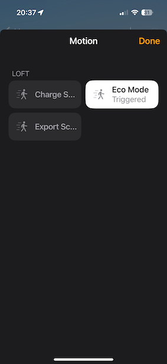

# homebridge-givenergy

## Overview

This is a simple module to present the state of a GivEnergy Inverter and Battery to HomeKit via 
Homebridge. It is a work in progress, the source code can be found on [GitHub](https://github.com/grahamhar/homebridge-givenergy-inverter)
and [issues](https://github.com/grahamhar/homebridge-givenergy-inverter/issues) can also be raised there. We also welcome
pull requests.

## Usage

Installation should be as simple as adding an API Key for your GivEnergy Account, the inverter will be added and should
then be seen in your home app. It is recomended to create an room just for you solar install. Below are screenshots showing
what this will look like.

The room will have a switch representing the inverter, when solar is being generated it will be on and it will
be off when there is no generation.

To see the energy flows(export to grid, import from grid and solar generation) click on the Light level, the level shown
as lux will be the amount in Watts currently being generated, this is limited to 10000 so if you are lucky enough to have
an array that can generate at this level it will max out for you.

Three of the states which can be configured via the GivEnergy App or via the Web UI are represented as motion detectors,
if they are triggered that represents enabled. In the example below this shows eco mode is enabled and that 
scheduled charge and scheduled export are currently disabled. Unfortunately a way to represent the times for these has not
been found.

